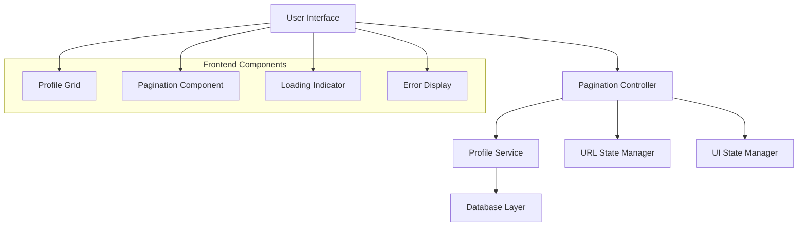

# Design Document

## Overview

Tính năng phân trang hồ sơ được thiết kế để cải thiện hiệu suất và trải nghiệm người dùng khi xem danh sách hồ sơ. Hệ thống sẽ chia danh sách hồ sơ thành các trang với 6 hồ sơ mỗi trang, cung cấp điều hướng dễ dàng và thông tin rõ ràng về vị trí hiện tại trong danh sách.

Thiết kế tập trung vào việc tối ưu hóa hiệu suất bằng cách chỉ tải dữ liệu cần thiết cho mỗi trang, đồng thời duy trì trải nghiệm người dùng mượt mà với các chuyển đổi trang không cần tải lại toàn bộ trang.

## Architecture

### High-Level Architecture



### Component Interaction Flow

1. **User Request**: Người dùng truy cập trang hồ sơ hoặc click vào số trang
2. **URL Processing**: Hệ thống xử lý tham số trang từ URL
3. **Data Fetching**: Controller gọi service để lấy dữ liệu hồ sơ cho trang cụ thể
4. **UI Update**: Cập nhật giao diện với dữ liệu mới và thông tin phân trang
5. **State Management**: Cập nhật trạng thái URL và UI components

## Components and Interfaces

### 1. PaginationController
**Responsibility**: Xử lý logic phân trang và điều phối giữa các components

```csharp
public class PaginationController
{
    public async Task<IActionResult> Index(int page = 1, int pageSize = 6)
    public async Task<JsonResult> GetProfilesPage(int page, int pageSize)
    public PaginationInfo CalculatePaginationInfo(int totalItems, int currentPage, int pageSize)
}
```

### 2. ProfilePaginationService
**Responsibility**: Xử lý business logic cho việc phân trang hồ sơ

```csharp
public interface IProfilePaginationService
{
    Task<PaginatedResult<UserProfile>> GetPaginatedProfilesAsync(int page, int pageSize);
    Task<int> GetTotalProfileCountAsync();
    PaginationInfo CalculatePaginationInfo(int totalItems, int currentPage, int pageSize);
}
```

### 3. PaginationComponent (Frontend)
**Responsibility**: Hiển thị điều hướng phân trang

```javascript
class PaginationComponent {
    constructor(containerId, options)
    render(paginationInfo)
    bindEvents()
    navigateToPage(pageNumber)
}
```

### 4. ProfileGridComponent (Frontend)
**Responsibility**: Hiển thị danh sách hồ sơ

```javascript
class ProfileGridComponent {
    constructor(containerId)
    renderProfiles(profiles)
    showLoading()
    hideLoading()
    showError(message)
}
```

## Data Models

### PaginatedResult<T>
```csharp
public class PaginatedResult<T>
{
    public IEnumerable<T> Items { get; set; }
    public PaginationInfo PaginationInfo { get; set; }
}
```

### PaginationInfo
```csharp
public class PaginationInfo
{
    public int CurrentPage { get; set; }
    public int TotalPages { get; set; }
    public int TotalItems { get; set; }
    public int PageSize { get; set; }
    public bool HasPreviousPage { get; set; }
    public bool HasNextPage { get; set; }
    public int StartItem { get; set; }
    public int EndItem { get; set; }
}
```

### ProfileViewModel
```csharp
public class ProfileViewModel
{
    public int ProfileId { get; set; }
    public string FullName { get; set; }
    public string Avatar { get; set; }
    public string Summary { get; set; }
    public string Location { get; set; }
    public decimal? ExpectedSalary { get; set; }
    public DateTime UpdatedDate { get; set; }
    public List<string> Skills { get; set; }
    public List<string> Professions { get; set; }
}
```

## Correctness Properties

*A property is a characteristic or behavior that should hold true across all valid executions of a system-essentially, a formal statement about what the system should do. Properties serve as the bridge between human-readable specifications and machine-verifiable correctness guarantees.*

### Property 1: Page Size Consistency
*For any* page request with valid parameters, the system should return exactly 6 profiles per page (except for the last page which may contain fewer profiles if the total count is not divisible by 6)
**Validates: Requirements 1.1**

### Property 2: Correct Page Count Calculation
*For any* total number of profiles, the system should calculate the correct number of pages using the formula: ceiling(totalProfiles / pageSize)
**Validates: Requirements 1.2**

### Property 3: Consistent Profile Ordering
*For any* page request made multiple times with the same parameters, the profiles should be returned in the same order
**Validates: Requirements 1.5**

### Property 4: Pagination Component Visibility
*For any* profile dataset with more than 6 profiles, the pagination component should be displayed with the correct number of page links
**Validates: Requirements 2.1**

### Property 5: Page Navigation Accuracy
*For any* valid page number clicked, the system should navigate to that page and display the correct subset of profiles
**Validates: Requirements 2.2**

### Property 6: URL State Synchronization
*For any* page navigation, the URL should be updated to reflect the current page number
**Validates: Requirements 2.5**

### Property 7: Current Page Display
*For any* page being viewed, the system should correctly display the current page number
**Validates: Requirements 3.1**

### Property 8: Total Pages Display
*For any* profile dataset, the system should correctly calculate and display the total number of pages
**Validates: Requirements 3.2**

### Property 9: Total Profiles Display
*For any* profile dataset, the system should correctly display the total number of profiles available
**Validates: Requirements 3.3**

### Property 10: Page Information Updates
*For any* page change, all relevant display elements (current page, total pages, profile count) should be updated immediately
**Validates: Requirements 3.5**

### Property 11: Previous Button State
*For any* page greater than 1, the Previous button should be enabled; for page 1, it should be disabled
**Validates: Requirements 4.1**

### Property 12: Next Button State
*For any* page less than the total pages, the Next button should be enabled; for the last page, it should be disabled
**Validates: Requirements 4.2**

### Property 13: Previous Navigation
*For any* page with a previous page available, clicking the Previous button should navigate to the correct previous page
**Validates: Requirements 4.3**

### Property 14: Next Navigation
*For any* page with a next page available, clicking the Next button should navigate to the correct next page
**Validates: Requirements 4.4**

### Property 15: AJAX Page Updates
*For any* page navigation, the content should be updated without triggering a full page reload
**Validates: Requirements 4.5**

### Property 16: Efficient Data Loading
*For any* page request, only the profiles needed for that specific page should be loaded from the database
**Validates: Requirements 5.2**

### Property 17: Loading Indicator Display
*For any* profile loading operation, a loading indicator should be displayed during the fetch process
**Validates: Requirements 5.3**

### Property 18: Loading Indicator Removal
*For any* successful profile loading operation, loading indicators should be removed after completion
**Validates: Requirements 5.5**

## Error Handling

### Database Connection Errors
- Hiển thị thông báo lỗi thân thiện cho người dùng
- Log chi tiết lỗi để debug
- Cung cấp nút "Thử lại" để người dùng có thể reload

### Invalid Page Parameters
- Redirect về trang 1 nếu page parameter không hợp lệ
- Validate page number trong khoảng hợp lệ (1 đến totalPages)
- Xử lý gracefully khi pageSize không hợp lệ

### Network Errors (Frontend)
- Hiển thị thông báo lỗi mạng
- Implement retry mechanism với exponential backoff
- Maintain UI state khi có lỗi xảy ra

### Empty State Handling
- Hiển thị thông báo phù hợp khi không có hồ sơ nào
- Cung cấp hướng dẫn cho người dùng về cách tạo hồ sơ
- Maintain pagination component state ngay cả khi empty

## Testing Strategy

### Unit Testing
- Test pagination calculation logic với các edge cases
- Test URL parameter parsing và validation
- Test error handling scenarios
- Test component rendering với different data states

### Property-Based Testing
Sử dụng **xUnit** với **FsCheck** cho C# để implement property-based testing. Mỗi property test sẽ chạy tối thiểu 100 iterations để đảm bảo độ tin cậy.

**Property Test Requirements:**
- Mỗi property-based test phải được tag với comment tham chiếu đến correctness property trong design document
- Format: `**Feature: profile-pagination, Property {number}: {property_text}**`
- Mỗi correctness property phải được implement bởi một property-based test duy nhất
- Configure mỗi test chạy tối thiểu 100 iterations

**Test Coverage:**
- Page calculation logic với random profile counts
- Navigation behavior với random page sequences  
- URL state management với various parameter combinations
- UI state consistency across different scenarios
- Error handling với simulated failure conditions

### Integration Testing
- Test full pagination workflow từ database đến UI
- Test performance với large datasets
- Test concurrent user scenarios
- Test browser compatibility cho AJAX functionality

### End-to-End Testing
- Test user journey từ landing page đến profile detail
- Test pagination với real data
- Test responsive behavior trên different screen sizes
- Test accessibility compliance cho pagination controls